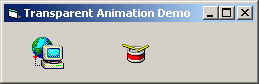



## Transparent animation in seconds

### Description

Create your own picture-animations in second, with only 5 line Code - without any API or OCX!

Superfast.
 
### More Info
 

             |
---                |---
**Submitted On**   |2002-02-20 01:18:12
**By**             |[MarcelB](https://github.com/Planet-Source-Code/PSCIndex/blob/master/ByAuthor/marcelb.md)
**Level**          |Intermediate
**User Rating**    |4.9 (39 globes from 8 users)
**Compatibility**  |VB 5\.0, VB 6\.0
**Category**       |[Graphics](https://github.com/Planet-Source-Code/PSCIndex/blob/master/ByCategory/graphics__1-46.md)
**World**          |[Visual Basic](https://github.com/Planet-Source-Code/PSCIndex/blob/master/ByWorld/visual-basic.md)
**Archive File**   |[Transparen564492202002\.zip](https://github.com/Planet-Source-Code/marcelb-transparent-animation-in-seconds__1-31969/archive/master.zip)

